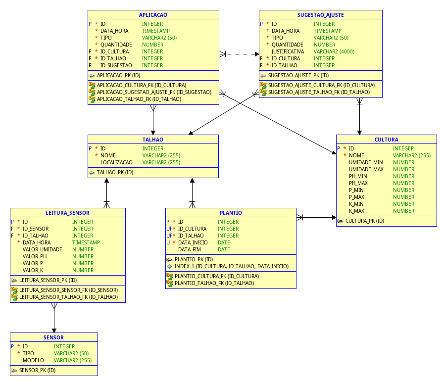

# Modelo Entidade-Relacionamento (MER) - FarmTech Solutions

Este documento descreve o Modelo Entidade-Relacionamento (MER) para o sistema de gestão de dados de sensoriamento para a agricultura de precisão da FarmTech Solutions. O objetivo deste modelo é representar as entidades relevantes e seus relacionamentos para o armazenamento e análise dos dados coletados pelos sensores e das ações tomadas na plantação.

## Entidades e seus Atributos

### 1. CULTURA

Representa as diferentes culturas plantadas.

- **ID** (PK): Identificador único da cultura (Integer).
- **NOME**: Nome da cultura (String).
- **UMIDADE_MIN**: Nível mínimo ideal de umidade para a cultura (Number).
- **UMIDADE_MAX**: Nível máximo ideal de umidade para a cultura (Number).
- **PH_MIN**: Nível mínimo ideal de pH para a cultura (Number).
- **PH_MAX**: Nível máximo ideal de pH para a cultura (Number).
- **P_MIN**: Nível mínimo ideal de fósforo (P) para a cultura (Number).
- **P_MAX**: Nível máximo ideal de fósforo (P) para a cultura (Number).
- **K_MIN**: Nível mínimo ideal de potássio (K) para a cultura (Number).
- **K_MAX**: Nível máximo ideal de potássio (K) para a cultura (Number).

### 2. TALHAO

Representa as diferentes áreas (talhões) da plantação.

- **ID** (PK): Identificador único do talhão (Integer).
- **NOME**: Nome ou identificação do talhão (String).
- **LOCALIZACAO**: Localização geográfica do talhão (String, Opcional).

### 3. SENSOR

Representa os sensores utilizados para coletar dados.

- **ID** (PK): Identificador único do sensor (Integer).
- **TIPO**: Tipo de sensor (umidade, pH, nutrientes) (String).
- **MODELO**: Modelo do sensor (String).

### 4. LEITURA_SENSOR

Armazena as leituras dos sensores em diferentes momentos.

- **ID** (PK): Identificador único da leitura (Integer).
- **ID_SENSOR** (FK): Identificador do sensor que realizou a leitura (Integer). Referencia a entidade `SENSOR`.
- **ID_TALHAO** (FK): Identificador do talhão onde a leitura foi realizada (Integer). Referencia a entidade `TALHAO`.
- **DATA_HORA**: Data e hora da leitura (DateTime).
- **VALOR_UMIDADE**: Valor da leitura de umidade (Number, Opcional).
- **VALOR_PH**: Valor da leitura de pH (Number, Opcional).
- **VALOR_P**: Valor da leitura de fósforo (P) (Number, Opcional).
- **VALOR_K**: Valor da leitura de potássio (K) (Number, Opcional).

### 5. SUGESTAO_AJUSTE

Registra as sugestões do sistema para ajustes na irrigação e aplicação de nutrientes.

- **ID** (PK): Identificador único da sugestão (Integer).
- **DATA_HORA**: Data e hora da sugestão (DateTime).
- **TIPO**: Tipo de ajuste sugerido (irrigação, nutriente) (String).
- **QUANTIDADE**: Quantidade sugerida para o ajuste (Number).
- **JUSTIFICATIVA**: Razão ou explicação para a sugestão (String, Opcional).
- **ID_CULTURA** (FK): Identificador da cultura relacionada à sugestão (Integer). Referencia a entidade `CULTURA`.
- **ID_TALHAO** (FK): Identificador do talhão relacionado à sugestão (Integer). Referencia a entidade `TALHAO`.

### 6. APLICACAO

Registra as aplicações de água e nutrientes realizadas na plantação.

- **ID** (PK): Identificador único da aplicação (Integer).
- **DATA_HORA**: Data e hora da aplicação (DateTime).
- **TIPO**: Tipo de aplicação (água, nutriente) (String).
- **QUANTIDADE**: Quantidade aplicada (Number).
- **ID_CULTURA** (FK): Identificador da cultura onde a aplicação foi realizada (Integer). Referencia a entidade `CULTURA`.
- **ID_TALHAO** (FK): Identificador do talhão onde a aplicação foi realizada (Integer). Referencia a entidade `TALHAO`.
- **ID_SUGESTAO** (FK): Identificador da sugestão que originou a aplicação (Integer, Opcional). Referencia a entidade `SUGESTAO_AJUSTE`.

### 7. PLANTIO

Representa o plantio de uma cultura em um talhão específico.

- **ID** (PK): Identificador único do plantio (Integer).
- **ID_CULTURA** (FK): Identificador da cultura plantada (Integer). Referencia a entidade `CULTURA`.
- **ID_TALHAO** (FK): Identificador do talhão onde a cultura foi plantada (Integer). Referencia a entidade `TALHAO`.
- **DATA_INICIO**: Data de início do plantio (Date).
- **DATA_FIM**: Data de fim do plantio (Date, Opcional).

## Relacionamentos entre as Entidades

- Uma **CULTURA** pode estar relacionada a muitos **PLANTIOS** (1:N).
- Um **TALHAO** pode estar relacionado a muitos **PLANTIOS** (1:N).
- Um **TALHAO** pode ter muitos **SENSORES** (1:N).
- Um **SENSOR** pode gerar muitas **LEITURAS_SENSOR** (1:N).
- Um **TALHAO** pode ter muitas **LEITURAS_SENSOR** (1:N).
- Uma **CULTURA** pode ter muitas **SUGESTOES_AJUSTE** (1:N).
- Um **TALHAO** pode ter muitas **SUGESTOES_AJUSTE** (1:N).
- Uma **SUGESTAO_AJUSTE** pode estar relacionada a zero ou uma **APLICACAO** (1:0..1).
- Uma **CULTURA** pode ter muitas **APLICACOES** (1:N).
- Um **TALHAO** pode ter muitas **APLICACOES** (1:N).

Este MER fornece uma visão geral das entidades e seus relacionamentos no banco de dados proposto para a FarmTech Solutions. Ele serve como base para a criação do Modelo Lógico e Físico do banco de dados.

## Diagrama do Fluxo de Dados

